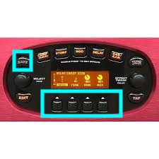

# Resetting a Line 6 POD XT on modern macOS

I have an old Line 6 POD XT that needed a factory reset. The catch: Line 6's software for managing it is 32-bit Intel Mac software from the late 2000s, and it won't launch on anything past macOS Mojave. No official tool, no obvious way in.

So I went digging — pulled apart the old apps, the driver, and the firmware file to figure out how the thing actually talks to a computer. This repo is what came out of that: the notes, the tools I wrote along the way, and — most usefully — the factory reset method that turned out not to need a computer at all.

## Just want to factory reset your POD XT?

You don't need any of the software. Do this on the unit itself:

1. Turn the POD XT **off**.
2. Hold **SAVE** + all four **UP** buttons at once.
3. Keep holding and turn it **on**.
4. Let go when the Line 6 logo appears.
5. Wait for **"standard model set loaded."**

That's it. Factory presets are back, and anything custom you saved is wiped.



**Which units?** Confirmed on my POD XT (the "bean"). The POD XT Live and POD XT Pro run the same firmware family and the same SAVE + UP combo is widely reported to work, though I haven't tested them personally. The button *layout* differs across those units, so "all four UP buttons" maps to whatever the four model/preset UP buttons are on yours.

## What's in here

```
docs/      Write-ups: full analysis, a shorter summary, and a reset guide
tools/     Python scripts for parsing the firmware and poking at the hardware
scripts/   The shell script I used to extract and set up the old software
images/    Photos, including the button combo above
```

Note: the Line 6 software and firmware files aren't in the repo — they're Line 6's, not mine to redistribute. The scripts expect you to supply your own copies (`Line 6 Monkey 1.78.dmg` and friends in `~/Downloads`). Grab them from Line 6's own software page: <https://line6.com/software/> (filter by POD XT). Line 6 Monkey and the legacy drivers are still listed there.

## The tools

- `tools/line6_analysis_tools.py` — parses the `.xtf` firmware (a Line 6 IFF variant they call L6FF) and inspects the old Mach-O binaries.
- `tools/podxt_factory_reset.py` — the cleanest of my attempts to trigger a reset over USB. Kept as the reference version; the button combo above is what actually worked in the end.
- `tools/attempts/` — the earlier trial-and-error reset scripts (USB, MIDI SysEx, various approaches). None reliably reset the unit, but a couple document the Line 6 SysEx command and USB product IDs, so I left them in.
- `scripts/line6_extraction_script.sh` — mounts and unpacks the legacy DMGs into an analysis folder.

## What I found

- **The POD XT is USB vendor `0x0e41`, product `0x5044`.**
- **Firmware** (`PODxt_3_01.xtf`) is an IFF container with an `L6FF` signature — 394,130 bytes, version 1.0.769.0, firmware 3.01. Twenty small device-info chunks up front, then ~393 KB of actual firmware.
- **Line 6 Monkey** (the management app) is a 32-bit i386 binary that needs macOS 10.5+ and stops running at 10.15.
- The reset lives in the hardware, not the software — the SAVE + UP combo during power-on does the whole thing.

## Poking at it yourself

You'll need `pyusb` and `libusb`:

```bash
pip3 install pyusb
brew install libusb
```

Then, with a firmware file of your own:

```bash
git clone https://github.com/cmadds/line6-reverse-engineering
cd line6-reverse-engineering
python3 tools/line6_analysis_tools.py path/to/PODxt_3_01.xtf
```

A word of caution: the original Line 6 software is old, 32-bit, and unsigned. I did the messier parts in a throwaway macOS 10.14 VM rather than on my main machine, and I'd suggest the same.

## Docs

- [Firmware format (.xtf / L6FF)](docs/firmware-format.md) — how the firmware file is laid out
- [Full analysis](docs/line6_reverse_engineering_analysis.md)
- [Short summary](docs/line6_reverse_engineering_summary.md)
- [Factory reset guide](docs/podxt_factory_reset_guide.md)

## Licence

The code and docs here are [MIT licensed](LICENSE) — use them however you like. This is research and interoperability work, shared in case it helps someone else get old Line 6 gear working again. The reverse engineering was done for interoperability under fair use; the Line 6 software, firmware, and drivers themselves belong to Line 6 / Yamaha and are not distributed here.
